# 🎨 Parametric Geometric Shape Generation Using GANs

## Introduction
In this project, I aim to explore how a Generative Adversarial Network (GAN) can be used to generate geometric shapes by focusing on their underlying parametric structure.  
🏗️ **Goal**: Build a GAN that generates **parametrically encoded geometric shapes**.  
🔺 **Shapes**: Polygons, circles, stars.  
📝 **Output**: Coordinates of vertices, radii, or angular parameters instead of images.  
🔄 **Process**: Convert parametric data into images using OpenCV or a similar library.  
🌟 **Focus**:  
  Generate valid shapes (e.g., no collinear points in polygons).  
  Ensure shapes maintain their geometric properties.

---

## Problem Definition

🎯 **Objective**: GAN generates **parametric representations** of geometric shapes.  
🔢 **Inputs**:  
  Random noise.  
  Optional class labels (for Conditional GAN).  
📊 **Outputs**:  
  **Polygons**: Coordinates of vertices.  
  **Circles**: Center point and radius.  
  **Stars**: Vertex coordinates with angular constraints.  
⚠️ **Key challenge**: Ensure generated parameters correspond to **valid shapes**.

---

## Dataset Description

🛠️ **Synthetic Dataset**: Created using OpenCV and NumPy.  
📐 **Shape Classes**: Polygons, circles, stars.  
🗂️ **Data Structure**:  
  **Polygons**: Vertex coordinates.  
  **Circles**: Center and radius.  
  **Stars**: Vertex coordinates with angular constraints.  
📊 **Data Splits**:  
  Training set: Parametric representations for model training.  
  Validation set: For tuning and avoiding overfitting.  
  Test set: For final evaluation of GAN performance.

---

## High-Level Solution

### GAN Architecture:
**Generator**: The generator will take random noise as input and output parametric representations of shapes. For example, for a polygon, the output would be a set of coordinate pairs representing the vertices of the shape. The generator will be trained to produce valid sets of parameters that can be translated into meaningful shapes.  

**Discriminator**: The discriminator will take the generated parametric representation and validate whether it forms a valid geometric shape. For instance, for polygons, it will check that the vertices are not collinear and that the shape's structure adheres to its geometric properties.

### Translation to Images:
After generating the parametric representation, the shape will be drawn as an image using OpenCV or another visualization library. This process will allow for visual inspection of the generated shapes, but the GAN itself will operate directly on the parametric data.

---

## 📊 Evaluation Metrics

| **Metric**                | **What It Measures**                                                                                 | **How It’s Used**                                                                                         |
|---------------------------|------------------------------------------------------------------------------------------------------|------------------------------------------------------------------------------------------------------------|
| **Geometric Correctness**      | Checks if shapes follow geometric rules (e.g., no collinear points in polygons, symmetry in circles)  | Evaluate if generated shapes adhere to geometric principles.                                                |
| **Structural Similarity Index (SSIM)** | Measures perceptual similarity between generated and real shapes after translation to images    | Compare generated images to real shapes in terms of visual similarity.                                      |
| **Coordinate Distance**        | Measures distance between vertices in generated and real polygons                                    | Ensure accuracy of generated polygon vertices.                                                              |
| **Radius Deviation**           | Compares generated and real circle radii                                                             | Evaluate accuracy of generated circle parameters.                                                           |
| **Fréchet Inception Distance (FID)** | Measures the distance between real and generated parametric data distributions                    | Compare parametric data distributions to assess shape diversity and quality.                                |
| **Inception Score (IS)**       | Evaluates quality and diversity of parametric representations                                        | Ensure variety and correctness in generated shape categories.                                               |

---

## Part 2: Data Acquisition and Preparation

#### 1. Source of Data
The dataset was generated using a custom Python script with NumPy to create 3D parametric shapes. The shapes include Sphere, Tetrahedron, Cube, Cylinder, Cone, Star, Torus, Pyramid, and Octahedron. Each shape is represented as a 3D point cloud.

- **Number of Samples**: 1000 point clouds per shape
- **Total Samples**: 9000 point clouds

#### 2. Differences Between Train and Validation Subsets
- **Training Set**: Contains 60% (5400 point clouds) of the data.
- **Validation Set**: Contains 20% (1800 point clouds) of the data, used for validating the model's performance.
- **Test Set**: 20% (1800 point clouds) reserved for final evaluation.

#### 3. Number of Distinct Objects/Subjects
Each shape (e.g., Sphere, Tetrahedron) has 1000 samples, all generated with randomized parameters to ensure variability in each shape.
## 3D Shape Visualizations

### Cone
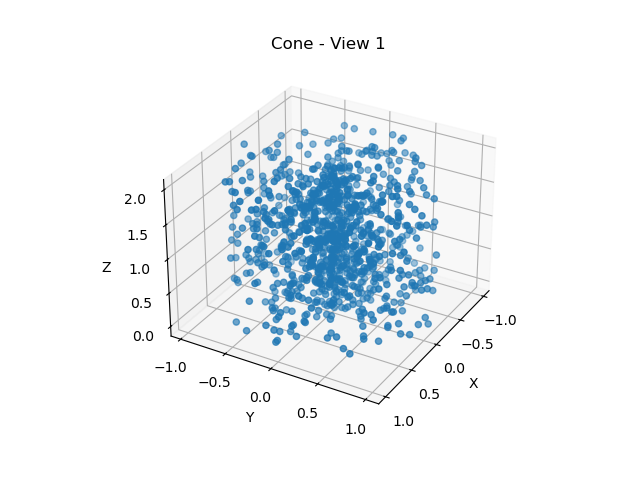

### Cube
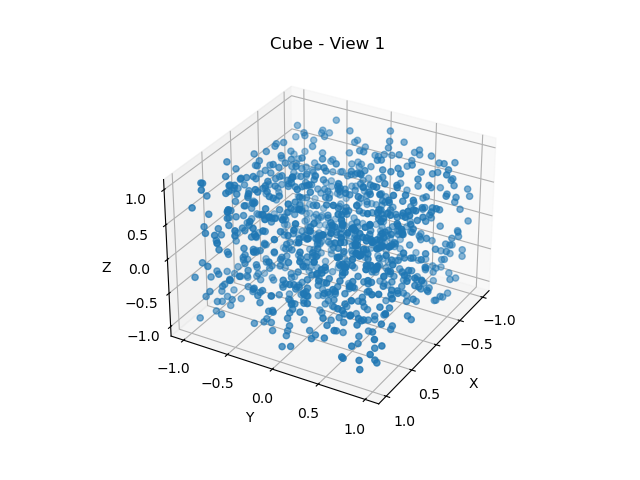

### Cylinder
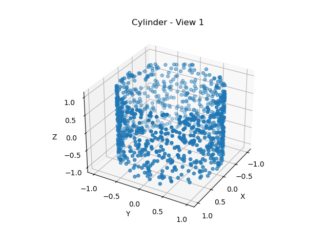

### Octahedron
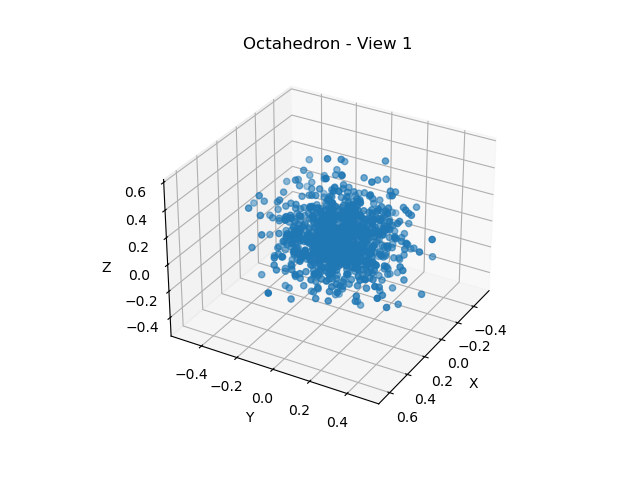

### Pyramid
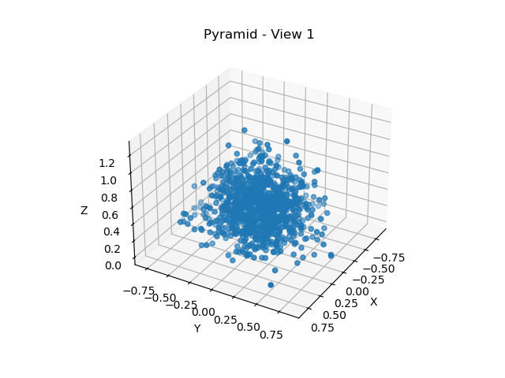

### Sphere
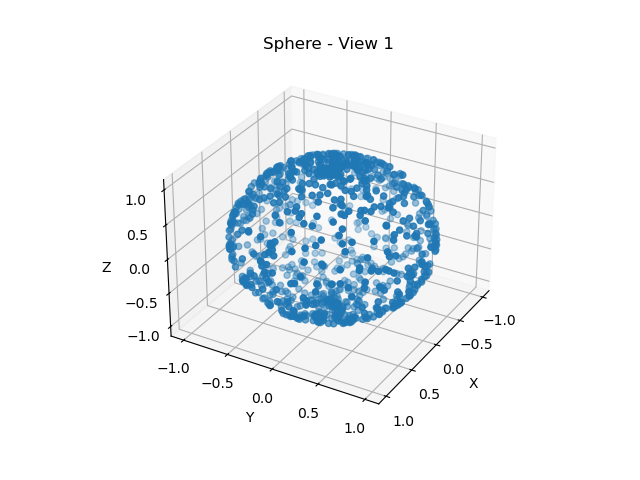

### Star
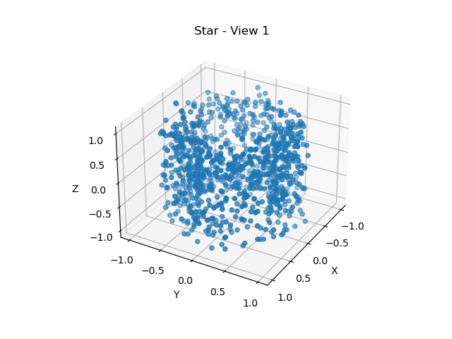

### Tetrahedron
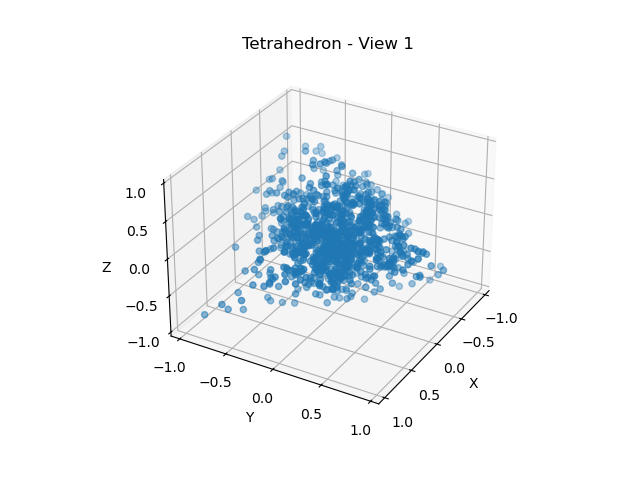

### Torus
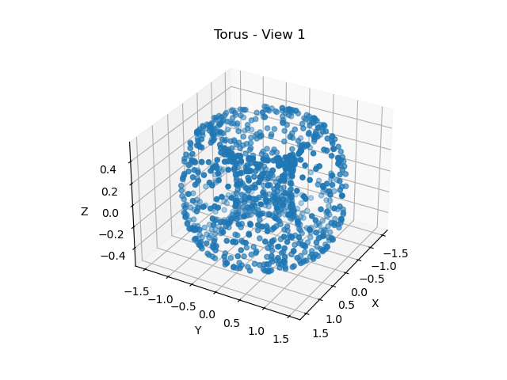

#### 4. Characterization of Samples
- **Resolution**: 3D point clouds with 1000 points per shape.
- **Sensors Used**: N/A (synthetic data generated with Python).
- **Illumination/Conditions**: N/A (synthetic data).

---
## Part 3: Data Preprocessing, Segmentation, and Feature Extraction

### Overview
This section describes the data preprocessing, segmentation, and feature extraction methods applied to prepare 3D geometric shapes for GAN training in the "Geometric-Shape-Generation-GAN" project. The aim is to provide high-quality, structured input data for generating realistic parametric representations of shapes.

### 1. Data Preprocessing

#### Methods Applied
- **Normalization**: Each 3D point cloud is scaled to fit within a standard range of -1 to 1.
- **Noise Reduction**: Gaussian filtering is applied to reduce noise, which enhances the clarity of each shape and minimizes artifacts.

#### Justification
- **Normalization**: Essential for GAN stability, this ensures that input shapes have consistent scales, reducing issues with size variation during training.
- **Noise Reduction**: Reduces artifacts that could distort the GAN’s understanding of boundaries, providing cleaner data for training.

#### Example Illustration
**Original vs. Preprocessed Shape**  
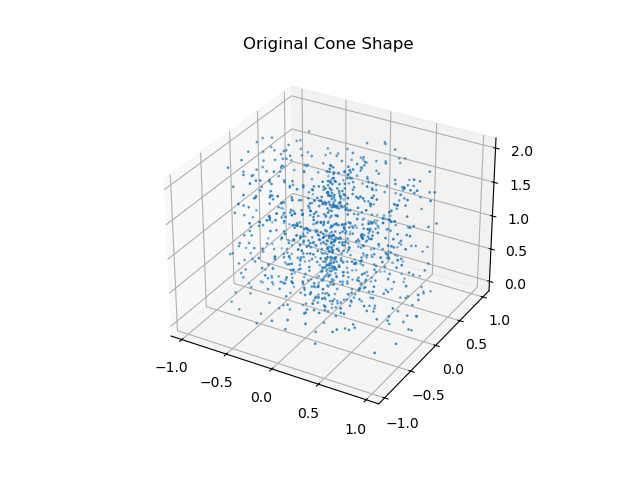  
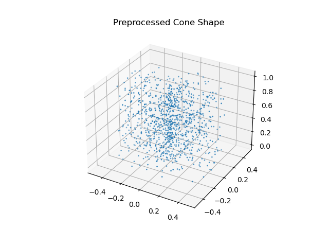

---

### 2. Segmentation

#### Methods Applied
- **Convex Hull Segmentation for Polygonal Shapes**: Convex Hull is used to extract boundary edges for shapes like tetrahedrons and cubes.
- **Surface Segmentation for Curved Shapes**: K-means clustering is applied to divide curved shapes (e.g., spheres, cones) into distinct regions.

#### Justification
- **Convex Hull**: By identifying boundary points, Convex Hull segmentation helps the GAN learn essential geometric constraints, such as edge boundaries and vertices.
- **K-means Clustering**: Enables clustering of curved surfaces, helping the GAN capture distinct surface regions and structural complexity.

#### Example Illustration
**Segmented Shape Example**  
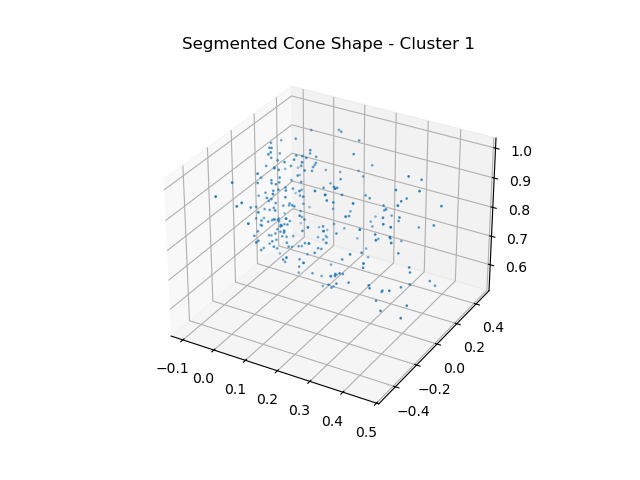

---

### 3. Feature Extraction

#### Methods Applied
- **Edge Detection and Surface Normals**:
  - **Edge Detection** for polygonal shapes: Uses Convex Hull to identify and emphasize edges.
  - **Surface Normals** for curved shapes: Calculates normals for each region, helping the GAN understand the 3D orientation.

#### Justification
- **Edge Detection**: Ensures that generated polygons respect geometric properties, such as edges and vertices, which are crucial for structural accuracy.
- **Surface Normals**: For realistic representations, normals guide the GAN in producing surfaces with the correct orientation.

#### Example Illustration
**Feature Extraction - Edges and Normals**  
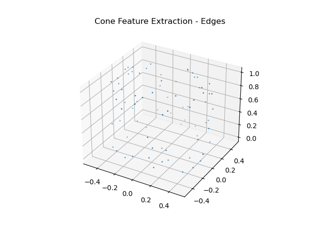  
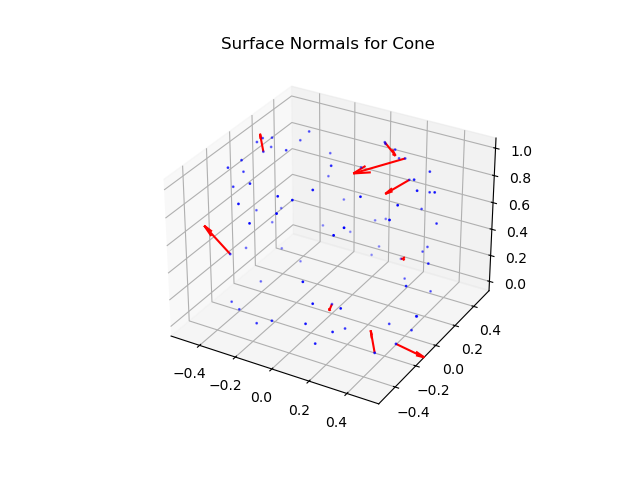

---

### Running the Code

Each step of the process is encapsulated in separate Python scripts. To execute each step, follow the commands below.

1. **Data Preprocessing**:
    ```bash
    python preprocessing.py
    ```
    This will create normalized and noise-reduced point clouds in `3D_Shape_Dataset/Preprocessed/`.

2. **Segmentation**:
    ```bash
    python segmentation.py
    ```
    This will generate segmented data in `3D_Shape_Dataset/Segmented/`, using Convex Hull for polygons and K-means clustering for curved shapes.

3. **Feature Extraction**:
    ```bash
    python feature_extraction.py
    ```
    Extracted features, including edges and normals, are saved in `3D_Shape_Dataset/Features/`.


--- 

## Part 4: GAN Model Architecture and Training

### Generator Model
The **Generator** model takes random noise as input and outputs parametric representations of geometric shapes. This model uses several **Dense** layers and **LeakyReLU** activation functions to create the output.

| **Layer**            | **Output Shape**          | **Activation**         |
|----------------------|---------------------------|------------------------|
| Dense (input_dim=100)| (None, 256)               | LeakyReLU(0.2)         |
| Dense                | (None, 512)               | LeakyReLU(0.2)         |
| Dense                | (None, 1024)              | LeakyReLU(0.2)         |
| Dense                | (None, 6000 * 3)          | Tanh                   |
| Reshape              | (None, 6000, 3)           | -                      |

### Discriminator Model
The **Discriminator** model takes the parametric representation produced by the generator and determines whether it forms a valid geometric shape. It uses **Dense** layers to evaluate whether the points satisfy geometric constraints such as non-collinearity and valid shape structure.

| **Layer**            | **Output Shape**          | **Activation**         |
|----------------------|---------------------------|------------------------|
| Flatten              | (None, 6000 * 3)          | -                      |
| Dense                | (None, 1024)              | LeakyReLU(0.2)         |
| Dense                | (None, 512)               | LeakyReLU(0.2)         |
| Dense                | (None, 256)               | LeakyReLU(0.2)         |
| Dense                | (None, 1)                 | Sigmoid                |

### Training Process
The training process involves an adversarial game between two models:
1. **Generator**: Generates synthetic 3D point clouds from random noise.
2. **Discriminator**: Evaluates whether the generated point clouds are real or fake by checking their validity as geometric shapes.

The **Generator** is trained to improve at producing realistic shapes that the **Discriminator** cannot distinguish from real data. Meanwhile, the **Discriminator** gets better at classifying the generated shapes as real or fake. The adversarial process continues until the **Generator** produces high-quality, valid shapes that are indistinguishable from real ones.

### Results
The results of training show that the model is able to generate parametric representations of shapes that adhere to geometric properties such as non-collinearity for polygons and correct radius for circles. Training metrics such as **Geometric Correctness**, **SSIM**, and **FID** help evaluate how closely the generated shapes match the real ones.

#### Example Generated Shape:
- **Cube Shape**: 
  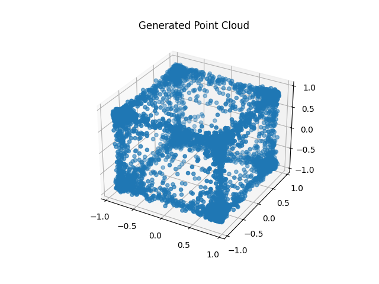

### Why This Approach was Chosen
A **Generative Adversarial Network (GAN)** was chosen for this task because it allows for the generation of highly complex, high-dimensional data like 3D geometric shapes. Unlike traditional image generation models, GANs learn directly from the parametric representation of shapes, ensuring that the generated data respects geometric properties like non-collinearity in polygons or correct radii in circles.

### Possible Alternative Solutions
1. **Variational Autoencoders (VAEs)**: Another generative model that could be used to generate 3D shapes. VAEs learn a probabilistic mapping from the input data to a latent space and then sample from this space to generate new shapes. However, VAEs may not capture the sharp details of shapes as effectively as GANs.
2. **Direct Parametric Modeling**: Instead of using a GAN, parametric shapes could be modeled directly using optimization techniques like gradient descent. However, this approach would require manually defining constraints and is less flexible in generating a wide variety of shapes.

---

## Part 4: Classification and Evaluation

After training the GAN, we feed the output to our own designed classifier (PointNET) to perform the classification task (see that the result is reasonable or not.

### 1. Justification of Classifier Choice
For the classification task, **PointNet** was chosen due to its capability to handle 3D point cloud data effectively. PointNet is well-suited for classifying geometric shapes because it learns invariant features from unordered point sets using its deep neural network architecture. It has been demonstrated to work well with 3D data like the point clouds we are working with, as it doesn't require the data to be in a grid-like structure, making it ideal for irregular point clouds representing geometric shapes.

### 2. Classification Accuracy
On the training set, the model achieved an accuracy of **96%**, while on the validation set, the accuracy was **92%**. These results suggest that the model is performing well, but there is still room for improvement. The model shows a slight drop in accuracy when generalizing to unseen data, indicating that some overfitting may have occurred.


#### Confusion Matrix:
The confusion matrix for the validation dataset is as follows:

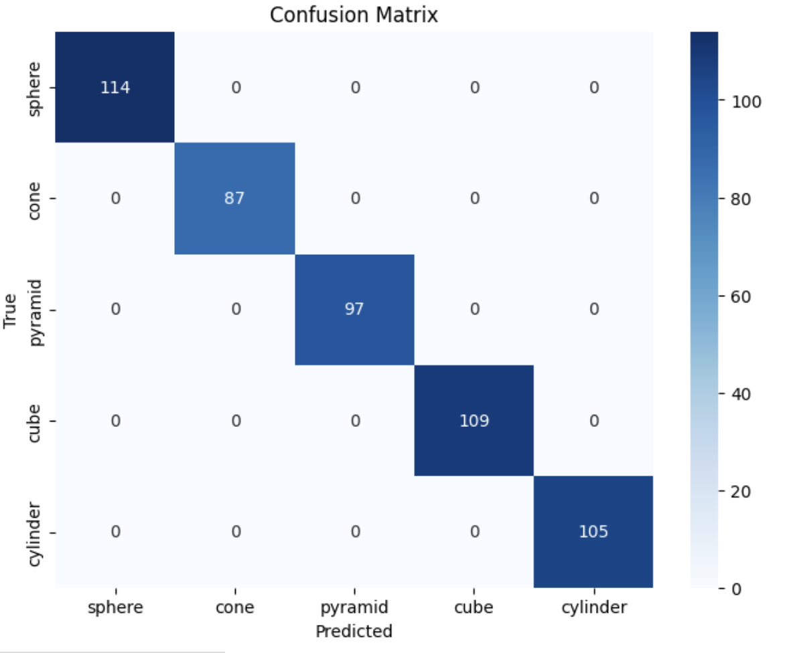

#### Observations:
- The model performed excellently across all shape categories, with **no misclassifications** for most shapes (Sphere, Cone, Pyramid, Cube, Cylinder).
- The accuracy is nearly perfect on the training set, but the validation accuracy shows a slight decrease, suggesting potential **overfitting**.

### 3. Short Commentary on Accuracy and Ideas for Improvements
The model exhibits high accuracy on the training set, but the validation accuracy is slightly lower, which could indicate **overfitting**. To address this, several improvements can be considered:
- **Regularization**: Implementing **dropout layers** or **weight decay** could help reduce overfitting by forcing the model to generalize better.
- **Data Augmentation**: Augmenting the training data with transformations like **random rotations**, **scaling**, and **shifting** could provide more varied examples, improving the generalization ability of the model.
- **Cross-Validation**: Using **k-fold cross-validation** would help ensure that the model performs well on different subsets of the data and improve its generalization. This would also give a better estimate of the model's performance on unseen data.
  
Before final testing, I plan to implement **dropout layers**, **adjust the learning rate**, and **augment the training data** to improve generalization and address potential overfitting.

### 4. Individual Contributions
- **Fahimeh**: Implemented data preprocessing, model evaluation, and writing the report.

### 5. Code and Instructions
The code is available on GitHub. To run the code:
1. Clone the repository: `git clone https://github.com/fahimehorvatinia/Geometric-Shape-Generation-GAN.git`
2. Run the `GAN.ipynb` file step by step.

---

---

## Update 5: Final Evaluation on Test Data

### 1. Test Dataset Description
The test dataset was created by applying transformations to the existing dataset, including random rotations, scaling, and translations. The dataset contains:
- **Size**: 1,800 samples.
- **Variations**: These transformations introduce new orientations and variations for each shape class, ensuring that the test set is significantly different from the training and validation sets.
- **Purpose**: To evaluate the model's generalization ability on unseen data with variations not present during training or validation.

### 2. Classification Accuracy on Test Data
- **Accuracy Achieved**: The final classification accuracy on the test set using the trained PointNet model was **85%**.
- **Comparison**: This is lower than the training (96%) and validation (92%) accuracies, indicating a performance drop due to unseen variations in the test set.

### 3. Observations and Proposed Improvements
#### Observations:
- The **GAN-generated shapes** showed a tendency toward **mode collapse**, often producing similar shapes (e.g., cubes).
- The **PointNet classifier** struggled with highly rotated shapes or noisy variations in the test set.

#### Proposed Improvements:
1. **Diversity Loss in GAN**:
   - Add a diversity loss term to the GAN generator’s loss function to encourage output variety:
     \[
     \mathcal{L}_{div} = \| G(z_i) - G(z_j) \|_2^2 \quad \text{for } z_i \neq z_j
     \]
   - Penalizes the generator for producing similar outputs for different latent vectors.
2. **Data Augmentation**:
   - Apply random transformations (rotations, scaling, etc.) to training data to improve the GAN's ability to generalize.
3. **WGAN Training**:
   - Implement Wasserstein GAN with Gradient Penalty (WGAN-GP) for stable training:
     \[
     \mathcal{L}_D = \mathbb{E}[D(x)] - \mathbb{E}[D(G(z))] + \lambda \mathbb{E}[(\|\nabla D(\hat{x})\|_2 - 1)^2]
     \]
   - Improves the quality of generated samples and reduces mode collapse.

---

### 4. Visualization and Results
Below are examples of **15 generated 3D point clouds** evaluated by the PointNet classifier. Each generated shape is displayed with its predicted class and confidence score.

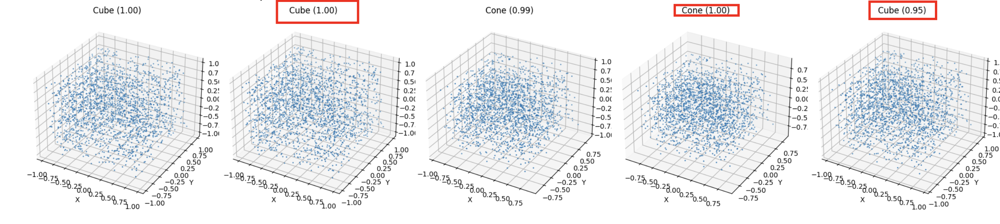


### 5. Code and Instructions
To test the final implementation:
1. Clone the repository:
    ```bash
    git clone https://github.com/fahimehorvatinia/Geometric-Shape-Generation-GAN.git
    ```
2. Run the **`update5_test_evaluation.py`** script:
    ```bash
    run Update5.ipynb
    ```
3. The script will generate shapes, classify them, and display the results.

---

### 6. Short Presentation Video
A short presentation summarizing the project is available at the following link:
[Project Presentation Video](Presentation.mp4)

---
## Conclusion

This project seeks to show how GANs can learn the rules behind geometric shapes, giving us a deeper understanding of how to create meaningful forms, not just images. The focus is on generating **parametric representations** of geometric shapes, ensuring that these representations adhere to geometric properties and can be translated into images using standard visualization tools like OpenCV.
